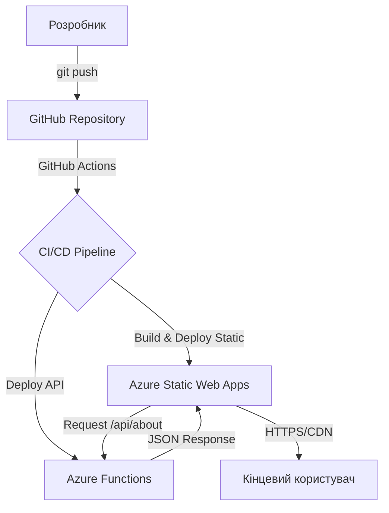

🚀 Azure Static Web Apps: IoT Portfolio Dashboard

Цей проєкт реалізовано в межах лабораторної роботи №2 з дисципліни «Хмарні технології та сервіси». Проєкт демонструє перехід від моделі IaaS до PaaS (Platform as a Service), використовуючи автоматизований CI/CD конвеєр.

🌐 Посилання на проект

Переглянути мій сайт у хмарі Azure

🏗️ Архітектура (Mermaid)

Проєкт використовує безсерверну (Serverless) архітектуру. Весь процес від написання коду до розгортання автоматизовано.

🛠️ Технологічний стек

Frontend: HTML5, Modern CSS (Flexbox/Grid), JavaScript (Vanilla).

Backend (Serverless): Azure Functions на базі Python (Programming Model v2).

Infrastructure: Microsoft Azure (PaaS).

Automation: GitHub Actions (CI/CD).

🌟 Виконані завдання

Основна частина:

[x] Налаштування GitHub репозиторію та локального середовища.

[x] Створення ресурсу Azure Static Web Apps.

[x] Конфігурація GitHub Actions для автоматичного деплою.

[x] Розробка та інтеграція Azure Functions API (/api/about).

Додаткові завдання (Advanced):

[x] Завдання A: Реалізовано додатковий API-ендпоінт для навичок та візуалізація через прогрес-бари.

[x] Завдання B: Додано стильний Dark Mode перемикач (Switch). Стан теми зберігається у localStorage.

[x] Завдання C: Створено професійну документацію (цей файл) з використанням Mermaid-діаграм для візуалізації хмарної архітектури.

📂 Структура проекту

├── .github/workflows/   # Конфігурація автоматичного деплою
├── api/                 # Backend: Azure Functions (Python)
│   ├── function_app.py  # Основний файл функцій
│   └── requirements.txt # Залежності Python
├── index.html           # Головна сторінка
├── styles.css           # Стилі (включаючи Dark Theme)
├── app.js               # Логіка Frontend та робота з API
└── README.md            # Документація проекту

© 2026 | Одеський національний університет імені І.І. Мечникова